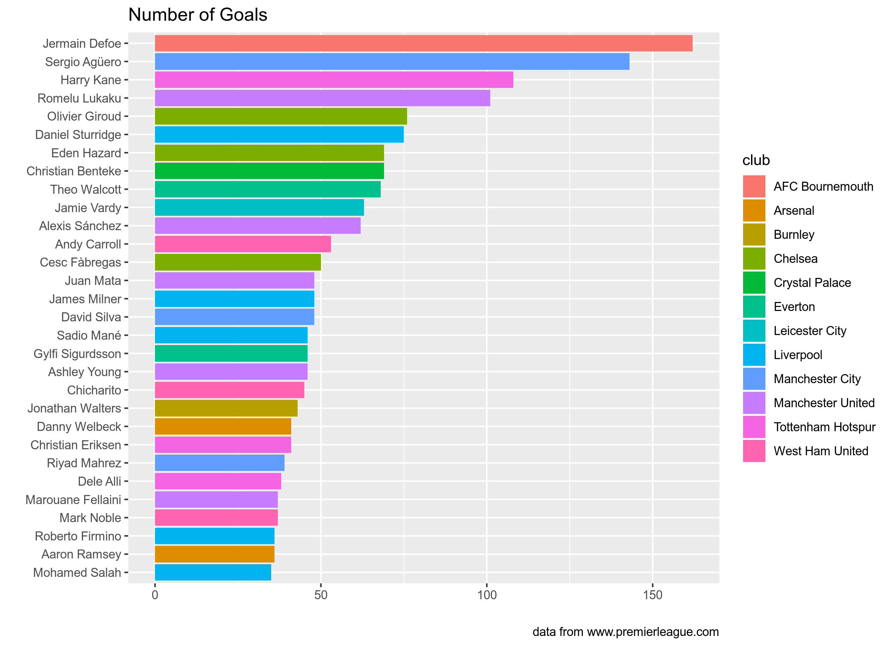
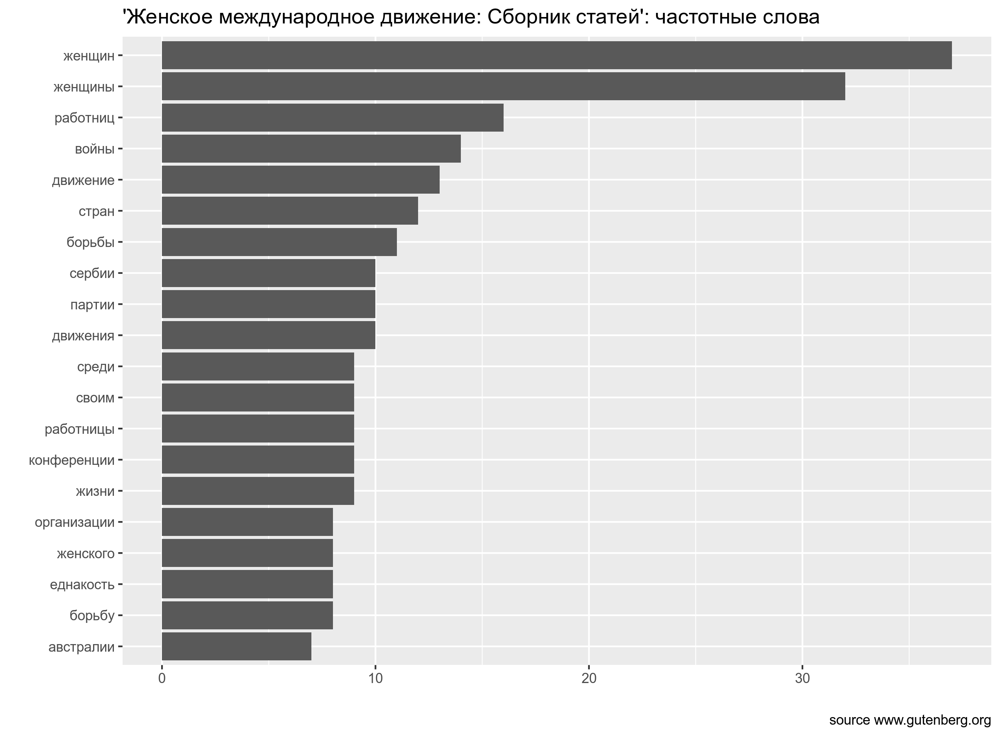
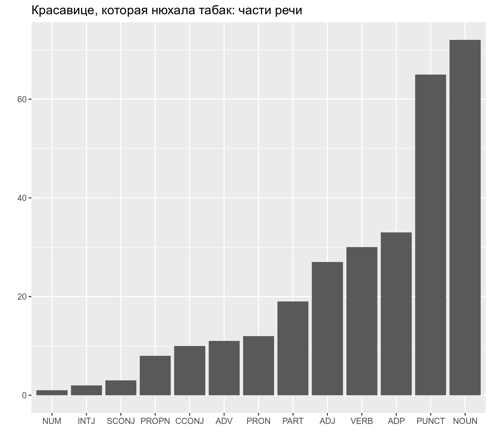

# Анализ данных для DH, hw3: purrr, gutenbergr, tidytext, udpipe

* дедлайн для задания: **14.12.2019, 23:59**
* все задания нужно сделать в файле `hw_3.Rmd`, а потом, написав свое имя в соответствующем поле файла `.Rmd`, скомпилировать `.html` и загрузить на Github Pages созданного репозитория
* задания не предполагают использование каких-то других пакетов или датасетов, кроме тех, что указаны в соответсвтующем файле `hw_3.Rmd`
* не стесняйтесь задавать вопросы (но лучше открывать issue, а не писать в телеграме). Помните, что я не смогу помочь, если все начнут писать в последний вечер перед дедлайном, так что начните делать задания заранее.

## Задание 3.1

В датасете, собранный [Adithya Ganesh](https://www.kaggle.com/adithyarganesh/english-premier-league-player-data-20182019#fpl_data_2018_2019.json), хранится информация об играках Английской Премьер-лиги. На основании этих данных (лежат в папке `data`) постройте график 30 игроков, которые забили больше всего голов и раскрасьте на основании их футбольного клуба.

## Задание 3.2
Скачайте из проекта gutenberg.org текст "Женское международное движение: Сборник статей". Используя список русских стопслов (папка `data`, файл `stopwords_ru.csv`), уберите из текста служебные слова, посчитайте и визуализируйте 20 самых частостных слов текста.

## Задание 3.3

* Скачайте из проекта <gutenberg.org> текст "Красавице, которая нюхала табак",
* используйте команду `str_c(text_5316$text, collapse = " ")`, чтобы объединить все строки, на которые поделено произведение в одну строку, 
* запустите на получившемся векторе анализатор `russian-syntagrus-ud-2.4-190531.udpipe`, 
* в получившемся датафрейме замените все пометы `DET` в столбце с частями речи (переменная `upos`) на `PART`, а у двух слов с пометой `AUX` поменяйте помету на `PART` (слово *б*) и на `VERB` (слово *быть*),
* посчитайте каждой из частей речи (переменная `upos`), 
* и постройте график:

