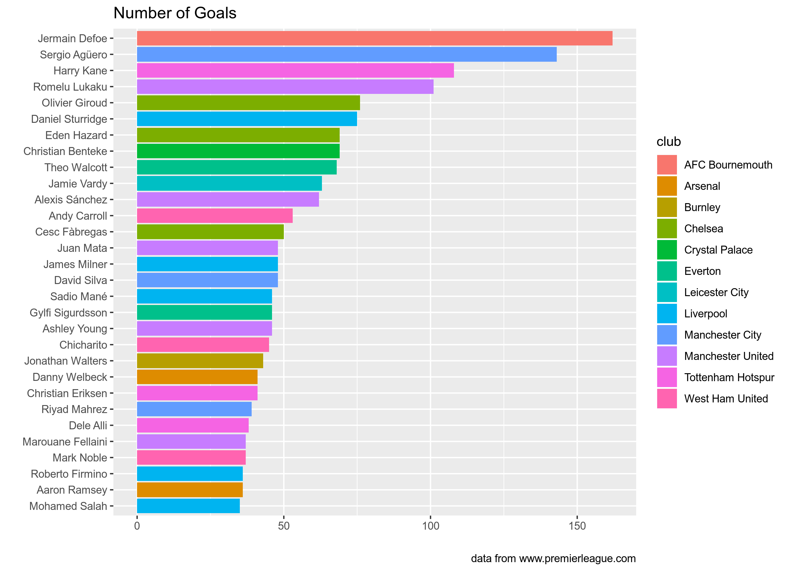
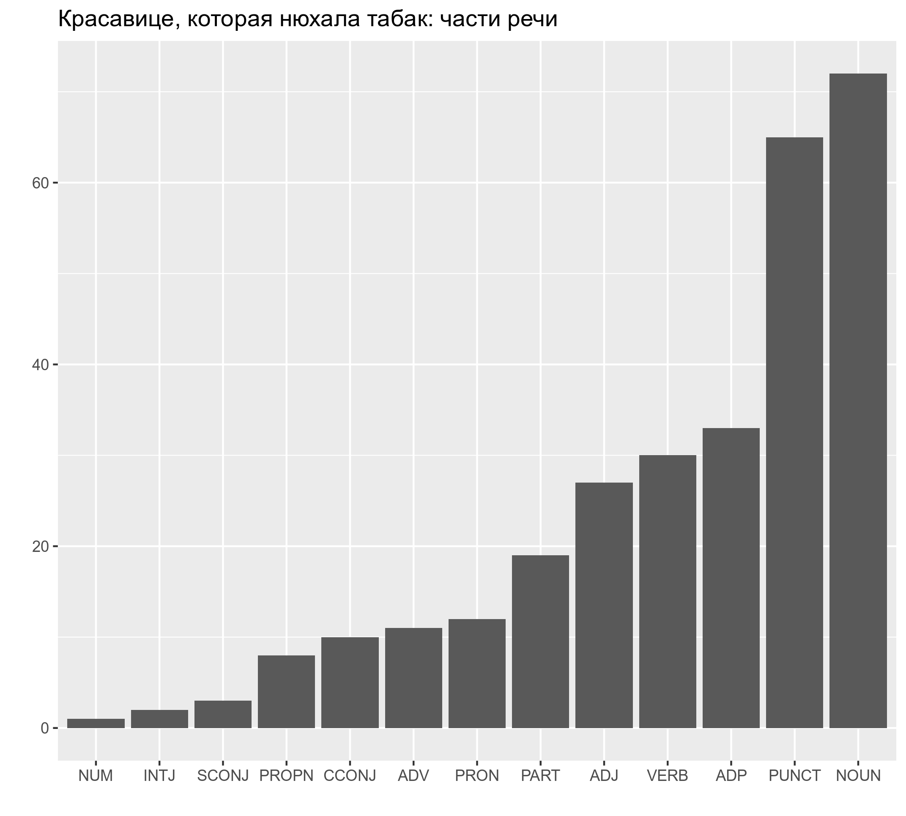

```{r, message=FALSE}
library(tidyverse)
library(tidytext)
library(gutenbergr)
library(udpipe)
```

## Задание 3.1

В датасете, собранный [Adithya Ganesh](https://www.kaggle.com/adithyarganesh/english-premier-league-player-data-20182019#fpl_data_2018_2019.json), хранится информация об играках Английской Премьер-лиги. На основании этих данных (лежат в папке `data`) постройте график 30 игроков, которые забили больше всего голов и раскрасьте на основании их футбольного клуба.


```{r}
fpl <- jsonlite::read_json("C:/Users/Elisaveta/Desktop/RStudio code/fpl_data_2018_2019.json")

Club <- fpl%>%
 map("Club")%>%
  unlist()%>%
  enframe()

Goals <- fpl%>%
  map("Goals")%>%
  unlist()%>%
  enframe()

table <- 
dplyr::full_join(Club, Goals, by = "name")
table$value.y<- as.numeric(as.character(table$value.y))

table%>%
  rename(Club = value.x)%>%
  arrange(desc(value.y))%>%
  slice(1:30)%>%
  ggplot(aes(fct_reorder(name, value.y), value.y, fill = Club))+
  geom_col()+
  coord_flip()+
  labs(x = "", y = "",caption = "data from www.premierleague.com", title = "Number of Goals")
```

## Задание 3.2
Скачайте из проекта gutenberg.org текст "Женское международное движение: Сборник статей". Используя список русских стопслов (папка `data`, файл `stopwords_ru.csv`), уберите из текста служебные слова, посчитайте и визуализируйте 20 самых частостных слов текста.


```{r}
nachalo <- gutenberg_download(37196)
stop_words <- read_csv("C:/Users/Elisaveta/Desktop/RStudio code/stopwords-ru.csv")

nachalo %>% 
  unnest_tokens(word, text) %>%
  count(word, sort = TRUE) %>%
  anti_join(stop_words)%>%
  slice(1:20)%>%
  ggplot(aes(fct_reorder(word, n), n))+
  geom_col()+
  coord_flip()+
  labs(y = "", x = "", title = "'Женское международное движение: Сборник статей': частотные слова", capture = "source www.gutenberg.org")
```


## Задание 3.3

* Скачайте из проекта <gutenberg.org> текст "Красавице, которая нюхала табак",
* используйте команду `str_c(text_5316$text, collapse = " ")`, чтобы объединить все строки, на которые поделено произведение в одну строку, 
* запустите на получившемся векторе анализатор `russian-syntagrus-ud-2.4-190531.udpipe`, 
* в получившемся датафрейме замените все пометы `DET` в столбце с частями речи (переменная `upos`) на `PART`, а у двух слов с пометой `AUX` поменяйте помету на `PART` (слово *б*) и на `VERB` (слово *быть*),
* посчитайте каждой из частей речи (переменная `upos`), 
* и постройте график:



```{r}
krasavitsa <- gutenberg_download(5316)
krasavitsa <- str_c(krasavitsa$text, collapse = " ")
rumodel <- udpipe_download_model(language = "russian-syntagrus")
krasotka <- udpipe(krasavitsa, object = rumodel)

krasa <- krasotka%>%
  select(token, lemma, upos)%>%
  mutate(upos = str_replace(upos,"DET", "PART")) %>%
  mutate(upos = case_when(lemma == "бы" ~ "PART",
                          lemma == "быть" ~ "VERB",
                          TRUE ~ upos)) %>%
  count(upos)

krasa%>%
  ggplot(aes(fct_reorder(upos, n), n))+
  geom_col()+
  labs(x = "", y = "", title = "Красавице, которая нюхала табак: части речи")
```

